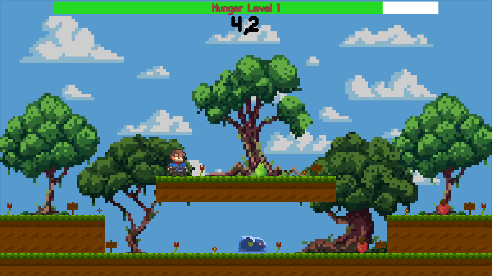

#Hunger
Проект для первого gameJam (Ludure GameJam 50)
Тема: Delay the inevitable (Отсрочка неизбежного)

В данном проекте цель игрока прожить как можно большее количество времени, утоляя свой голод с помощью различных фруктов, при этом:

- Фрукты бывают как съедобные, так и нет. Съедобные удовлетворяют голод, несъедобные - усиливают.
- Фрукты разделены на те, которые растут на деревьях и те, которые растут на земле. Одни появляются на ветках и падают вниз, другие появляются на земле.
- В игре присутствует N количество уровней. Новый уровень получается при заполнении полоски голода.
- При получении нового уровля происходит увеличении скорости голода, а так же небольшое увеличение сытности подбираемой еды.
- В игре присутствет противник в виде слизи, который также питается фруктами. Его показатели жизни и силы пропорциональны. 
Он может поедать любые фрукты, но за пропавшие/несъедобные он получает большее количество жизни/силы.
- Противник может быть убит, в результате чего из него выпадет Золотое Яблоко. Оно даёт больше сытости, чем другие фрукты. Золотое яблоко не может быть испорчено или съедено слизью.

Управление: WASD, где S можно использовать чтобы проваливаться сквозь платформы. ЛКМ - атака. Esc - поставить игру на паузу, или снять с паузы.

    
    
Процесс игры

